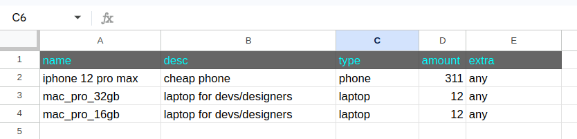

# Simple Google Sheet syncer

### Updates/inserts into DB all the data stored in a Google Sheet.<br>

### Actors:
- Google Apps Script bound to a trigger.

- Webhook Python server.

- MS SQL Server.

<br>

# How to run

### 1. Register an ngrok account if you don't have one. Open an ngrok tunnel for a specific port (`WEBHOOK_PORT` to be updated in `.example.env` as needed). :

```sh
ngrok http 9000
```

**Check the returned URL and set it in your `Project Settings -> Script Properties` in Google Sheets. It must be something like:** [**http://ngrok-host-free.dev/webhook**](http://ngrok-host-free.dev/webhook**)

**As an optional step, you can regenerate the webhook secret used for authorization, but don't forget to update it on the Google Platform in `Script Properties`:**

```sh
openssl rand -hex 32
```

### 2. Source envs (edit this file before sourcing, and update `WEBHOOK_PORT`)

```sh
. .example.env
```

### 3. Raise Docker containers

```sh
docker compose up -d
```

### 4. Init schema in MS SQL Server. Run from the root project folder:
```sh
make init-db
```

### 5. Go to Google Sheets and name the table `products`. Prepare column names like this (can be skipped)



### 6. Try to insert/update rows with values.
